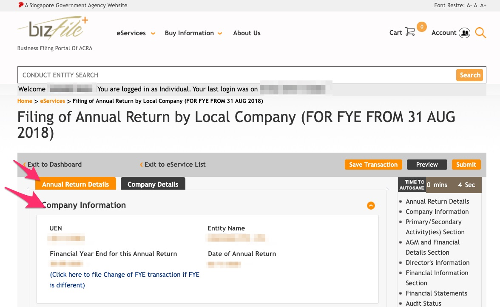
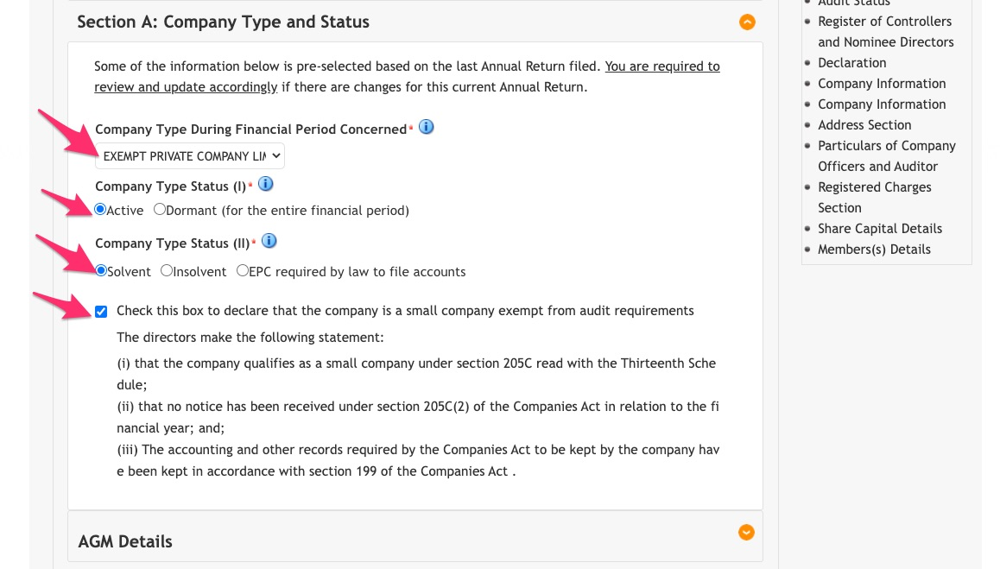
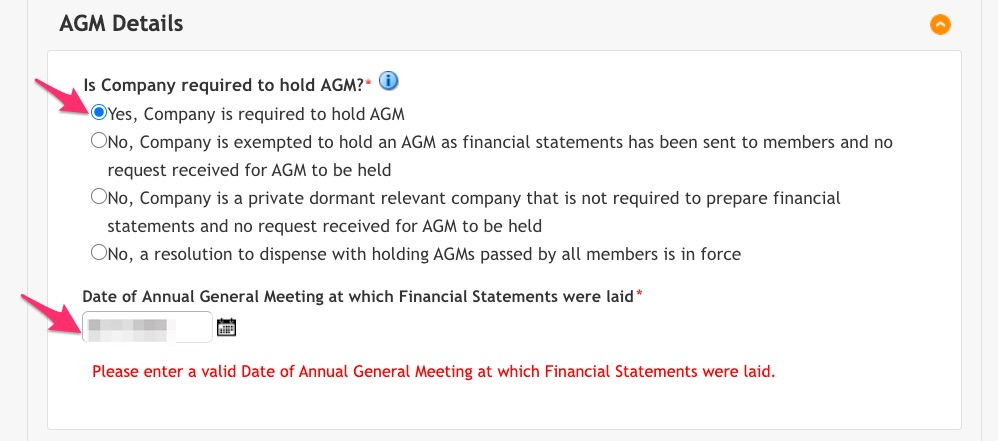
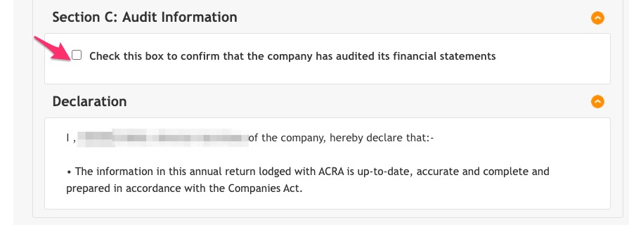
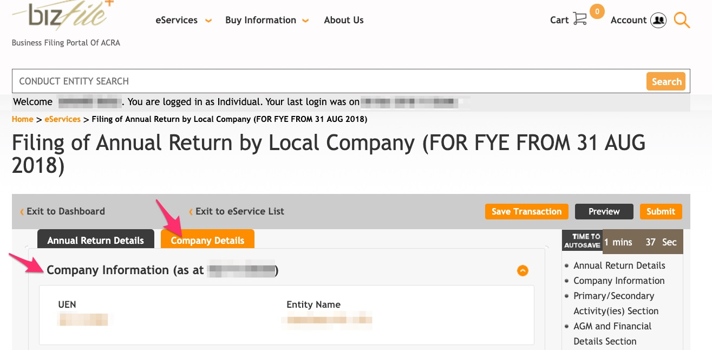
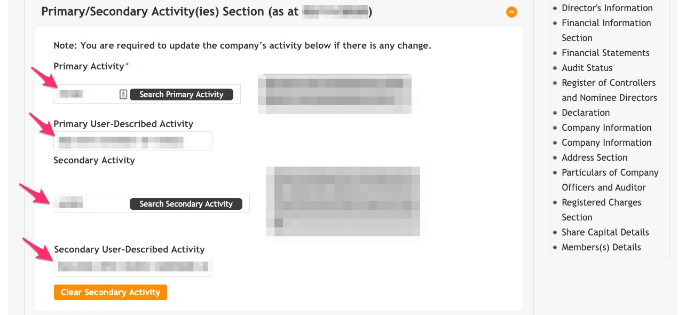
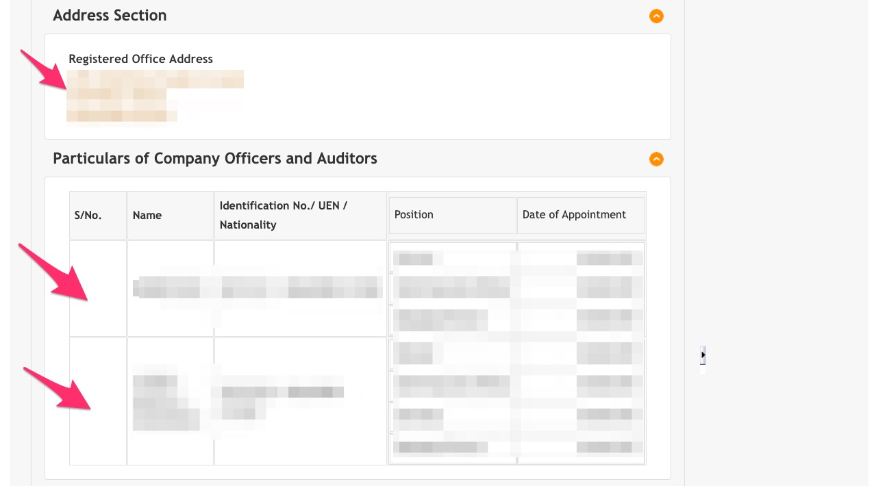
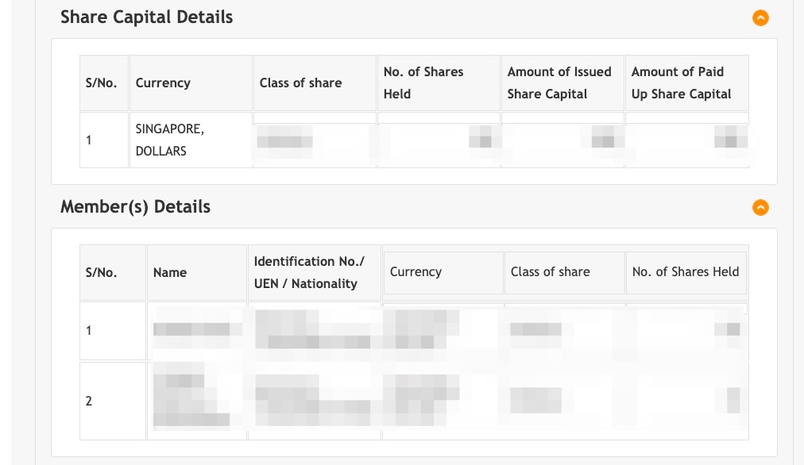
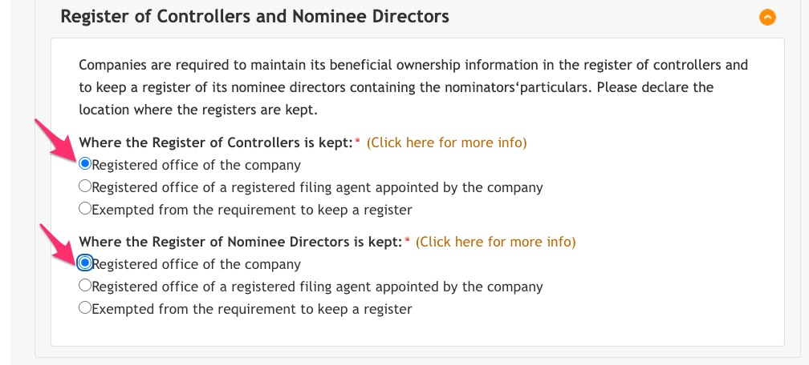

# ACRA

> 15 Nov: File AGM / Annual Filling with ACRA

1. Go to [Bizfile](http://www.bizfile.gov.sg/)
1. Click menu `eServices` > `Local Company` > `Annual Filing`

    
1. Click either `Annual Return by Local Company (For FYE from 31 Aug 2018)`

    
1. Under Tab 1, **Annual Return Details** check **Company Information**

    
1. Under Tab 1, **Annual Return Details** check **Section A: Company Type and Status**

    
1. Under Tab 1, **Annual Return Details** check **Section A: AGM**

    
1. Under Tab 1, **Annual Return Details** check **Section B: Financial Information**

    
1. Under Tab 1, **Annual Return Details** check **Section C: Audit Information and Declaration**

    
1. Under Tab 2, **Company Details** check **Company Information**

    
1. Under Tab 2, **Company Details** check **Primary / Secondary Activities**

    
1. Under Tab 2, **Company Details** check **Address and Company officiers and auditors**

    
1. Under Tab 2, **Company Details** check **Share capital and members**

    
1. Under Tab 2, **Company Details** check **Register of Controllers and Nominee Directors**

    
1. Confirm all the details

    
1. Make the payment of SGD 60.

    
1. Print and keep the Acknowledgement.

    
1. Download the free Bizfile PDF in the email next day .
