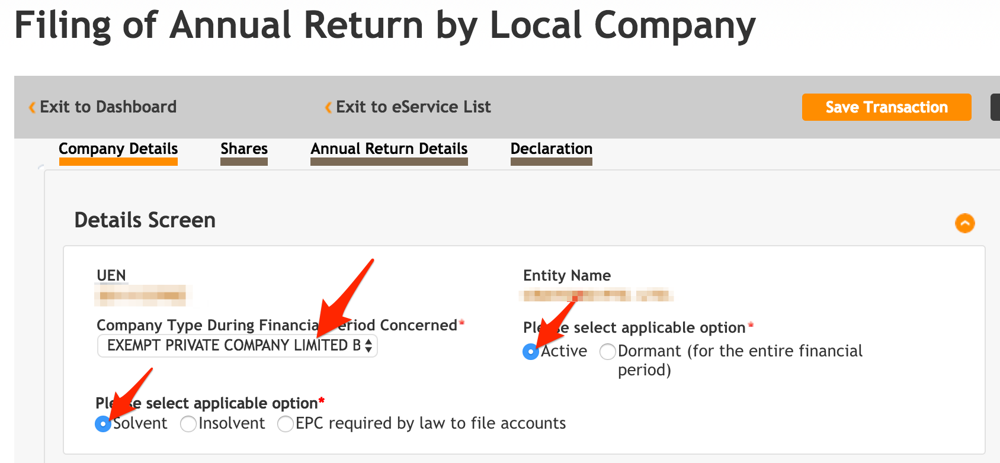
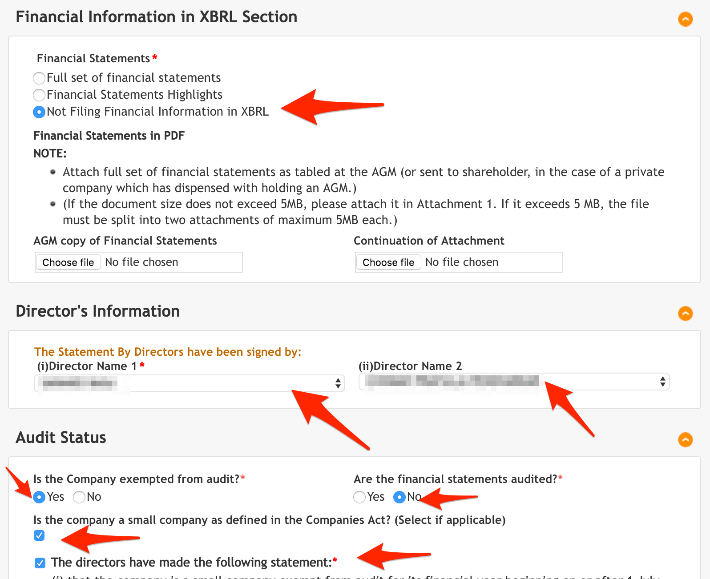
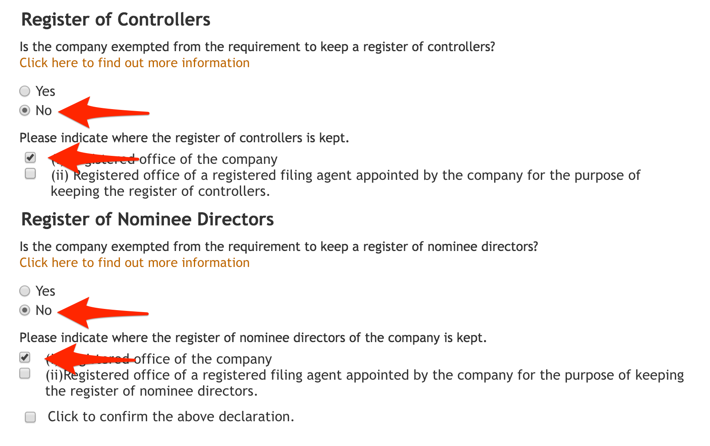

# ACRA

> 15 Nov: File AGM / Annual Filling with ACRA

1. Go to [Bizfile](http://www.bizfile.gov.sg/)
1. Click `Explore eServices` > `Local Company`
    
1. Click `Filing of Annual Return by Local Company`
    
1. Fill in UEN number
    
1. Fill up **Company Details** and click `Submit`
    
1. Fill up **Annual Return Details** and click `Submit`
  
  
1. Fill up **Declaration** and click `Submit`
  
  
1. Preview and pay `SGD 60`
1. Print the Acknowledgement
  
