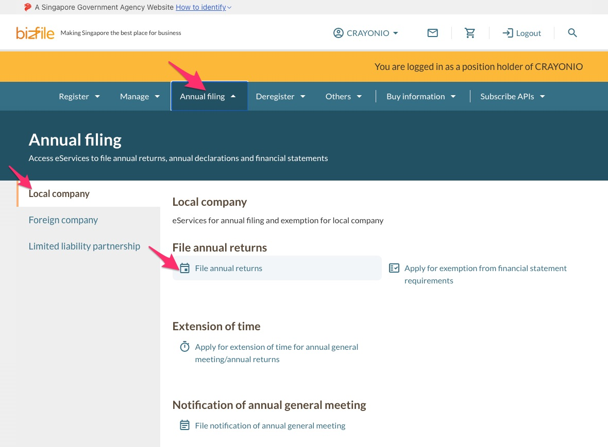
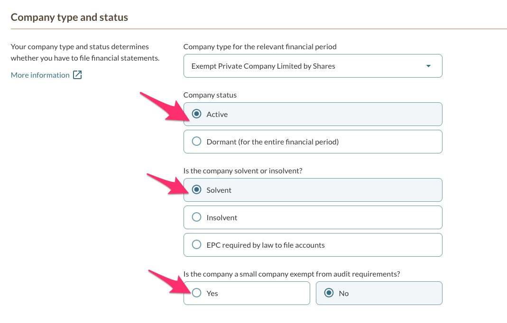
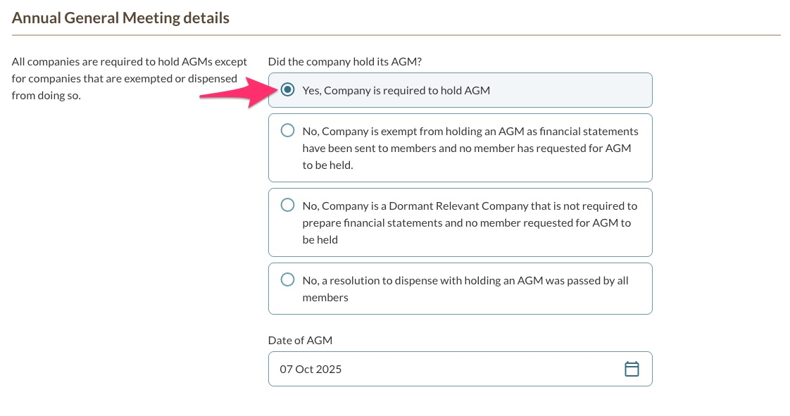
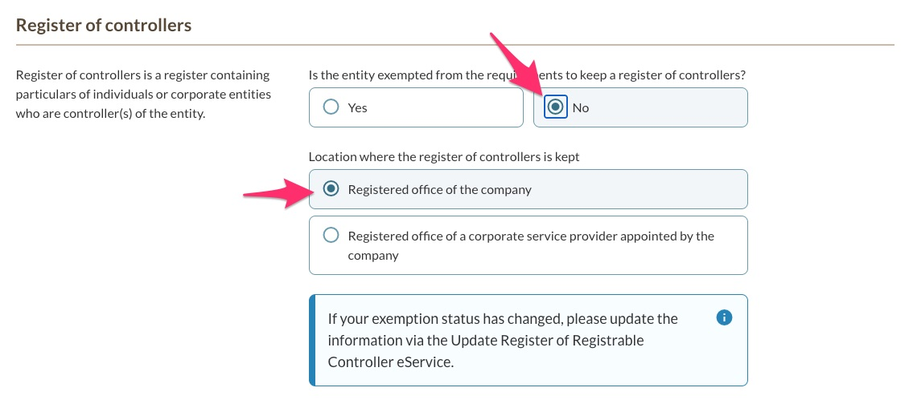
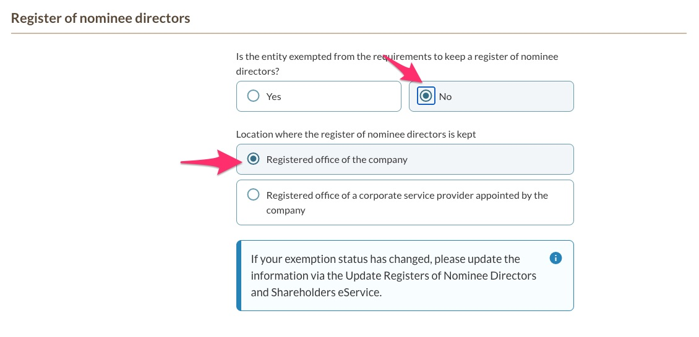
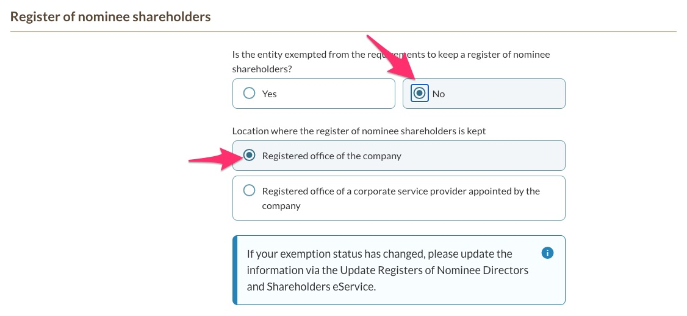
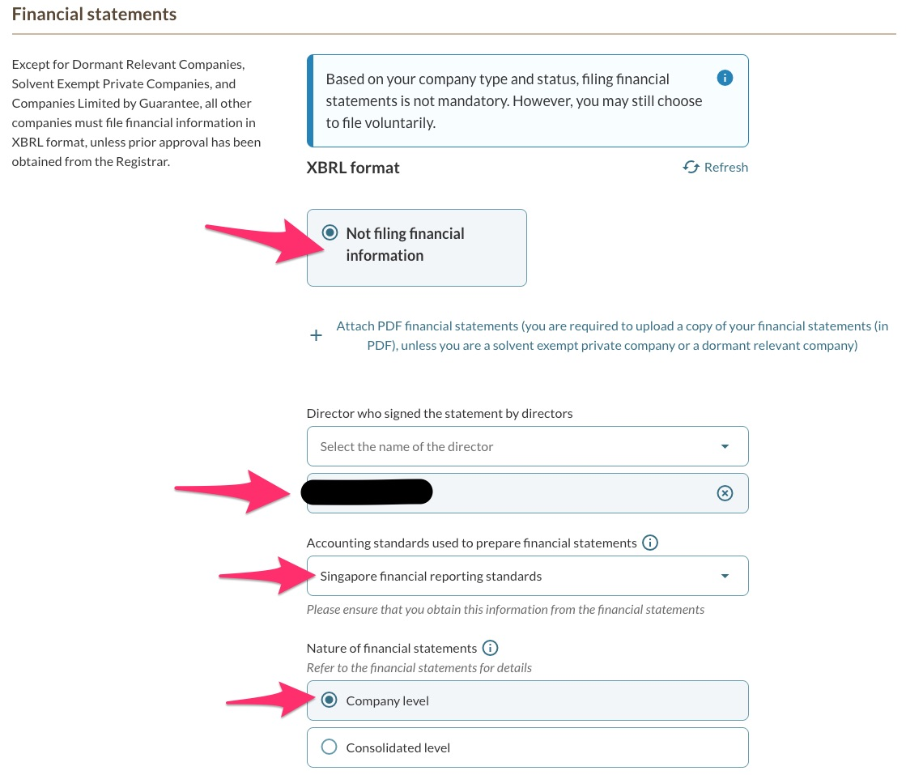
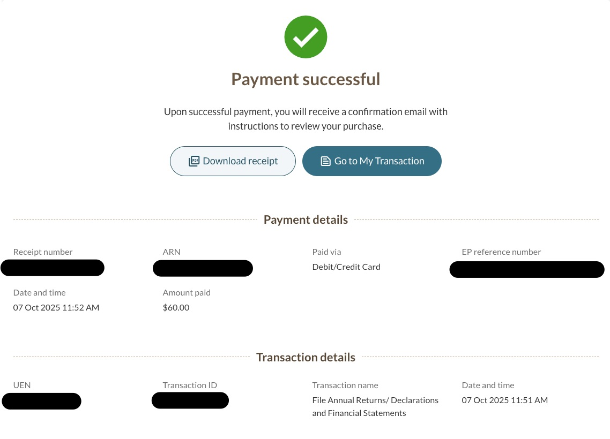
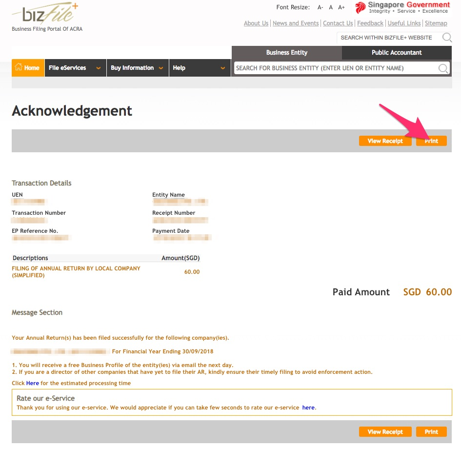

# ACRA

> 15 Nov: File AGM / Annual Filling with ACRA

1. Go to [Bizfile](http://www.bizfile.gov.sg/) and login with Singpass
1. Click menu `Annual Filing` > `Local Company` > `File Annual Return`

    
1. Choose the company type and status

    
1. Choose the AGM details

    
1. Choose the register of controllers details

    
1. Choose the options for register of nominee directors

    
1. Choose the options for register of nominee shareholders

    
1. Choose the options Financial Statements

    
1. Make the payment of SGD 60.

    
1. Print and keep the Acknowledgement.

    
1. Download the free Bizfile PDF in the email next day .
