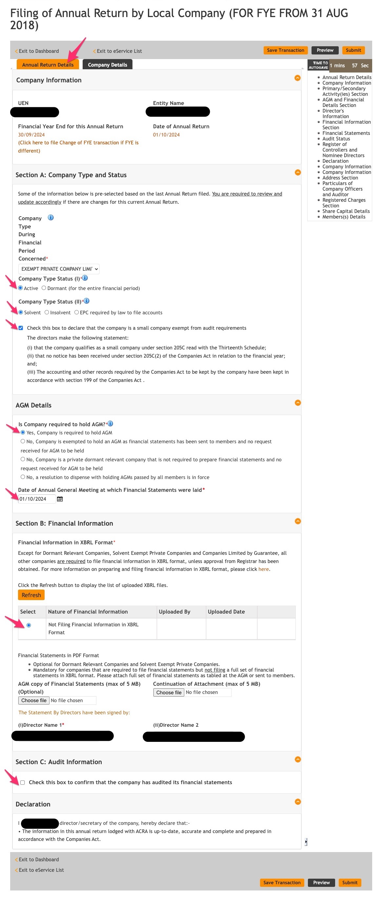

# ACRA

> 15 Nov: File AGM / Annual Filling with ACRA

1. Go to [Bizfile](http://www.bizfile.gov.sg/) and login with Singpass
1. Open the Google Sheets "Income & Expense" for the previous year
1. Click menu `eServices` > `Local Company` > `Annual Filing > Annual Return by Local Company (For FYE from 31 Aug 2018)`

    
1. Add UEN Number and click next

    
1. Under Tab 1, **Annual Return Details** check the details

    
1. Under Tab 2, **Company Details** check the details

    
1. Confirm all the details

    
1. Make the payment of SGD 60.

    
1. Print and keep the Acknowledgement.

    
1. Download the free Bizfile PDF in the email next day .
