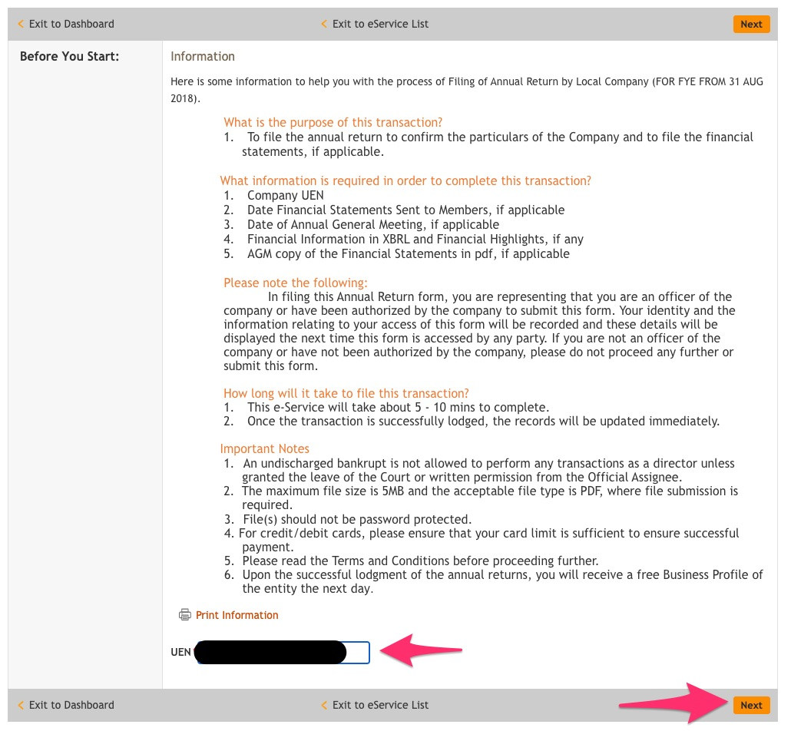

# ACRA

> 15 Nov: File AGM / Annual Filling with ACRA

1. Go to [Bizfile](http://www.bizfile.gov.sg/)
1. Click `File eServices` > `Local Company` > `Annual Filing`
    
1. Click either `Annual Return by Local Company (For FYE Before...)` or `Annual Return by Local Company (For FYE After...)` depending on your date
    
1. Login with Corppass
    
1. Fill in UEN number and choose `Simplified AR`
    
1. Check **Company Information**
    
1. Check **Shares**
    
1. Check **Annual Return Details**
    
1. Check **Declaration** and click `Submit`
    
1. Preview and click `Confirm`
    
1. Click `Pay Now` and pay online `SGD 60`
    
1. Print the Acknowledgement
    
