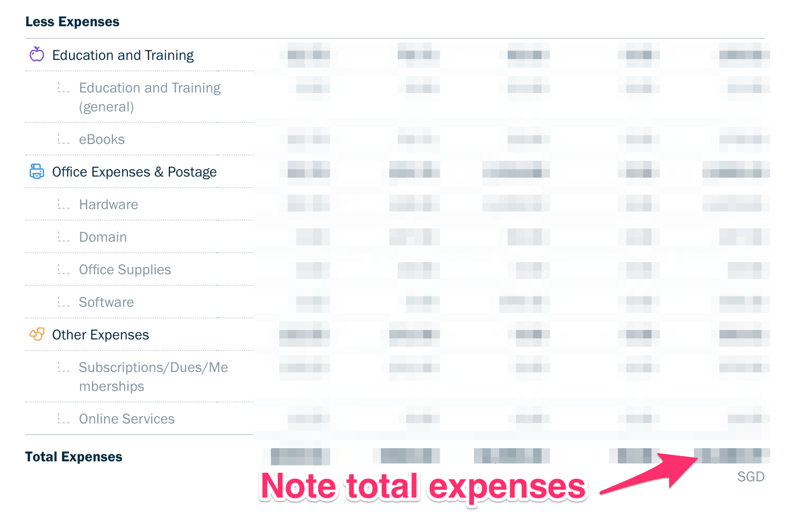
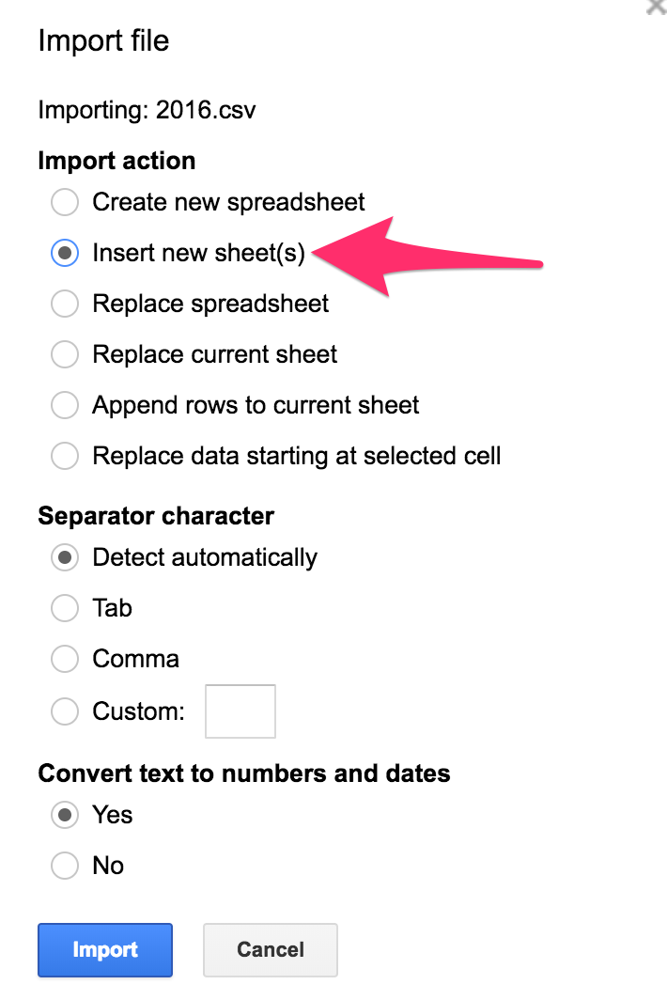

# Internal

> 31 Jan: Calculate Revenue, Expense and Gross profit / loss for the previous year

1. Click **Profit & Loss** from Dashboard in [Freshbooks](https://my.freshbooks.com)
  
1. Choose `for Last Year (SGD)` in timeline
1. Note **Income / Revenue** generated
  
1. Add other **expenses** from email (PayPal, eBay, Amazon, etc) and bank transactions
1. Note **Expense** generated
1. Download `*.csv` format of income and expense
   
1. Store the `*.csv` files in the `Income` and `Expense` folders in the Dropbox
1. Copy a **Income & Expense** spreadsheet from previous year in Google Drive
1. Delete sheets **Income** and **Expense**
11. Import the 2 `*.csv` files into 2 sheets **Income** and **Expense** in Google spreadsheet
  
11. Calculate **Gross Profit/Loss** in the **Overall** sheet by linking the cells for **Revenue** and **Expense**
