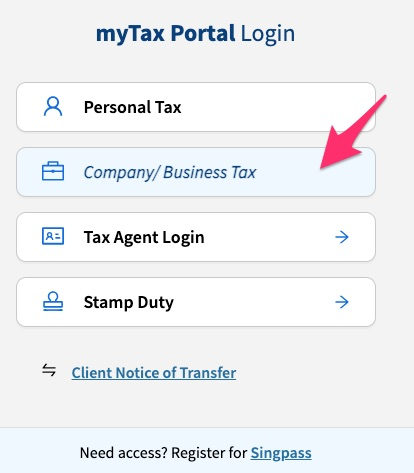
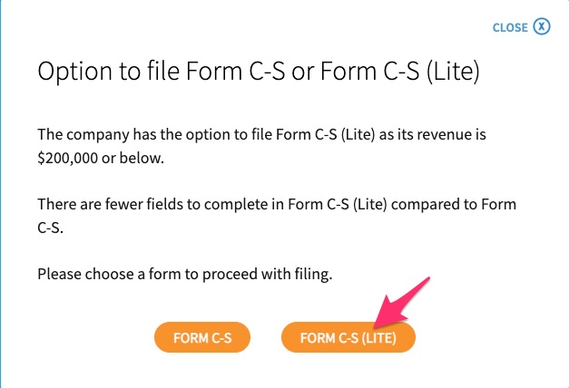
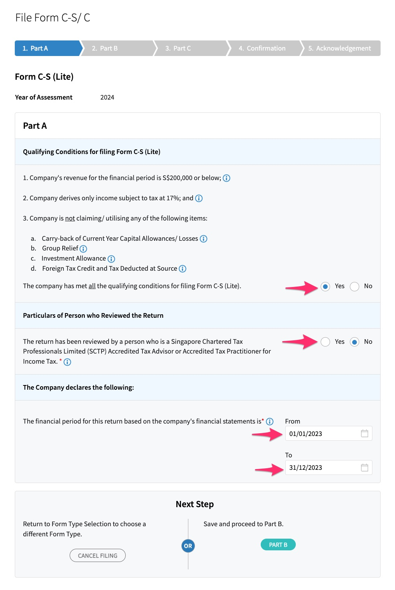
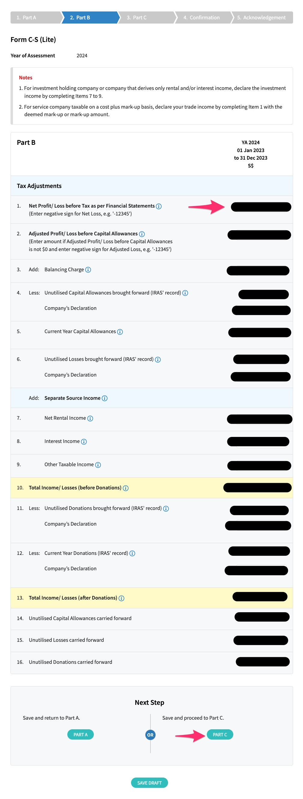
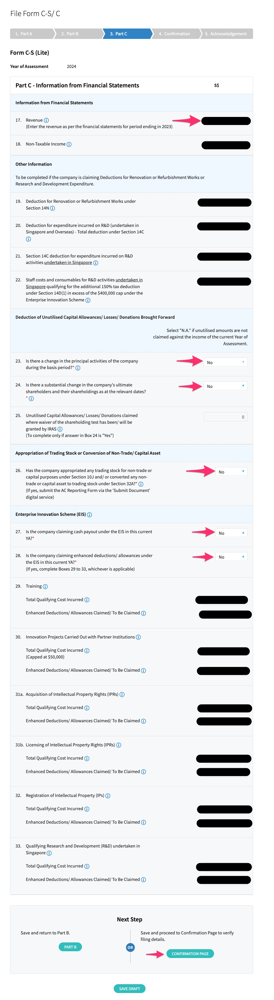
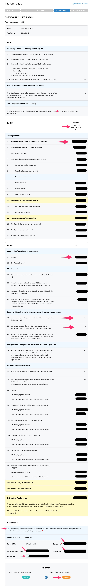
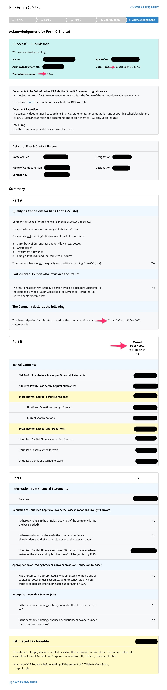

# IRAS

> 15 Nov: File Form CS online in IRAS

1. Go to <https://mytax.iras.gov.sg>
1. Click `Business Tax Matters`

    

1. Choose to e-file `Form C-S`

    
1. E-File for the year of assessment

    
1. Select type of Form

    
1. Choose Form-CS Lite

    
1. Complete **Part A** to ensure qualifying conditions are met for filing Form C-S

    
1. Complete **Part B** for Tax Adjustments

    
1. Complete **Part C** for Information from Financial Statement

    
1. Complete **Confirmation** and **Declaration**

    
1. Print **Acknowledgement** as PDF. Take note of the **Estimated Tax Payable**.

    
