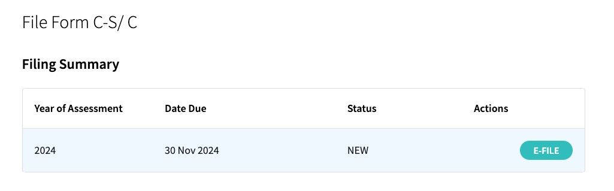

# IRAS

> 15 Nov: File Form CS online in IRAS

1. Go to <https://mytax.iras.gov.sg>
1. Click `Business Tax Matters`
    
1. Login with CorpPass
    
1. Choose to e-file `Form C-S`
    
1. E-File for the year of assessment
    
1. Complete **Part A** to ensure qualifying conditions are met for filing Form C-S
    
1. Complete **Part B** for Tax Adjustments

    
    
1. Complete **Part C** for Information from Financial Statement
    
    
1. Complete **Declaration** of filing
    
1. Print **Acknowledgement**
    
1. Save the downloaded PDF for records.
