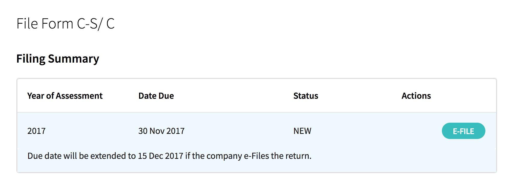
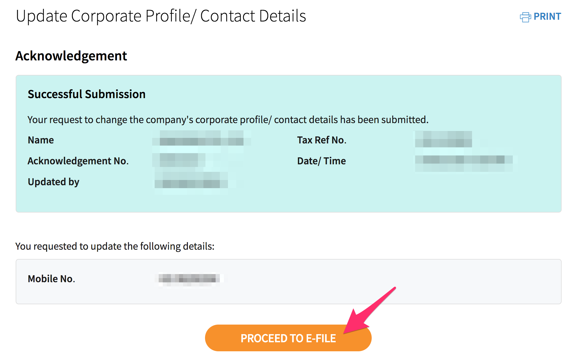
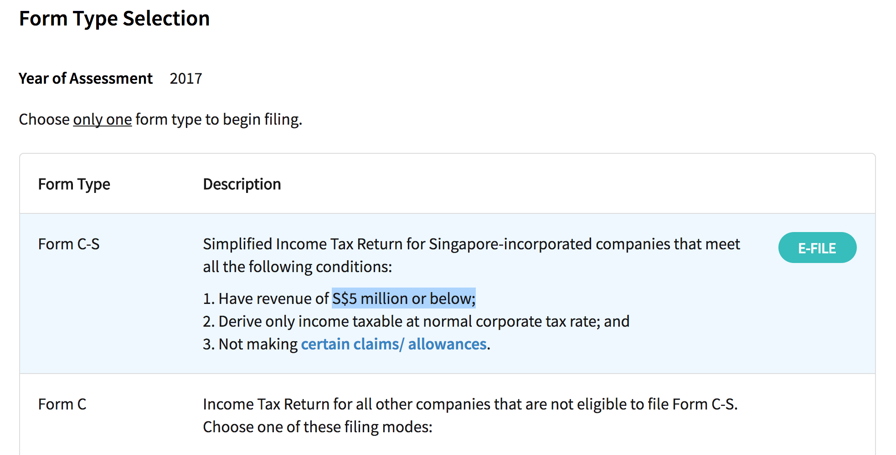

# Company admin

> Filling annual returns (through ACRA) and tax (through IRAS) for Singapore based small company.

## Important numbers

- Bank account
- Company ID / UEN

## Check company compliance

Check company compliance status on [BizFile](http://www.bizfile.gov.sg) anytime with company UEN.

## Definitions

1. **Small EPC**: EPC with annual revenue up to S$5 million or less for financial years
2. **ECI**: Estimated Chargeable Income
3. **ACRA** affairs:
    - AGM (Annual General Meeting)
    - AR (Annual Returns)
4. **IRAS** affairs:
   - Income Tax Return

---

## Yearly tasks

1. [31 Jan](https://github.com/sayanee/company-admin#internal) (internal) - Calculate Revenue, Expense and Gross profit / loss for the previous year
2. [15 Nov](https://github.com/sayanee/company-admin#iras) - File Form CS online with IRAS
3. [15 Nov](https://github.com/sayanee/company-admin#acra) - File AGM / Annual Filling with ACRA

---

## Internal

> 31 Jan: Calculate Revenue, Expense and Gross profit / loss for the previous year

1. Click **Profit & Loss** from Dashboard in [Freshbooks](https://my.freshbooks.com)
  

2. Choose `for Last Year (SGD)` in timeline

3. Note **Income / Revenue ** generated

  

4. Add other **expenses** from email (PayPal, eBay, Amazon, etc) and bank transactions

5. Note **Expense** generated

6. Download `*.csv` format of income and expense

   

7. Store the `*.csv` files in the `Income` and `Expense` folders in the Dropbox

8. Copy a **Income & Expense** spreadsheet from previous year in Google Drive

9. Delete sheets **Income** and **Expense**

10. Import the 2 `*.csv` files into 2 sheets **Income** and **Expense**

  

11. Calculate **Gross Profit/Loss** in the **Overall** sheet by linking the cells for **Revenue** and **Expense**

---

## IRAS

> 15 Nov: File Form CS online in IRAS

1. Go to <https://mytax.iras.gov.sg>
2. Fill in the `UEN-LOCAL-CO`
3. Click `Next`
  
4. Click `File Form C-S/C`
  
5. Ensure the information in the next few steps are correct
  
  
6. Ensure company has revenue of less than SGD 5 million to submit Form C-S
  
7. Complete **Part A** to ensure qualifying conditions are met for filing Form C-S
  
8. Complete **Part B** for Tax Adjustments
  
  
9. Complete **Part C** for Information from Financial Statement
   
   
10. Complete **Declaration** of filing
  
11. Print **Acknowledgement**
   

---

## ACRA

> 15 Nov: File AGM / Annual Filling with ACRA

1. Go to [Bizfile](http://www.bizfile.gov.sg/)
2. Click `Explore eServices` > `Local Company`
  
3. Click `Filing of Annual Return by Local Company`
  
4. Fill in UEN number
  
5. Fill up **Company Details** and click `Submit`
  

6. Fill up **Annual Return Details** and click `Submit`
  
  

7. Fill up **Declaration** and click `Submit`
  
  

8. Preview and pay `SGD 60`
9. Print the Acknowledgement
  
