# Company admin

> Filling annual returns (through ACRA) and tax (through IRAS) for Singapore based small company.

## Important numbers

- Bank account
- Company ID / UEN

## Check company compliance

Check company compliance status on [BizFile](http://www.bizfile.gov.sg) anytime with company UEN.

## Definitions

1. **Small EPC**: EPC with annual revenue up to S$5 million or less for financial years
2. **ECI**: Estimated Chargeable Income
3. **ACRA** affairs:
  - AGM (Annual General Meeting)
  - AR (Annual Returns)
4. **IRAS** affairs:
  - Income Tax Return

---

## Yearly tasks

1. [31 Jan](https://github.com/sayanee/company-admin#internal) (internal) - Calculate Revenue, Expense and Gross profit / loss for the previous year
2. [15 Nov](https://github.com/sayanee/company-admin#iras) - File Form CS online with IRAS
3. [15 Nov](https://github.com/sayanee/company-admin#acra) - File AGM / Annual Filling with ACRA

---

## Internal

> 31 Jan: Calculate Revenue, Expense and Gross profit / loss for the previous year

1. Calculate **revenue** from Invoices in [Freshbooks](https://freshbooks.com): `Reports > Item Sales > Export to > CSV`
  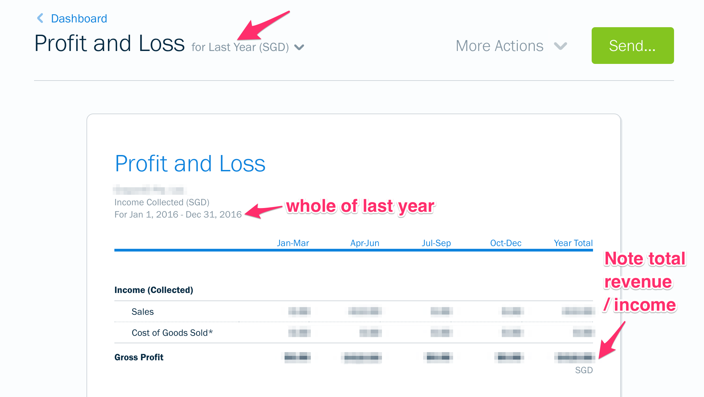

2. Create **expense** from email (PayPal, eBay, Amazon, etc), OCBC transactions in [Freshbooks](https://crayonio.freshbooks.com): `Reports > Accounting > Expense Report > Export to > CSV`
  

3. Download the `*.pdf` and `*.csv` of income and expense in the `Income/{YEAR}` and `Expense/{YEAR}` folders in the Dropbox
4. Create a Google Spreadsheet and keep it in the Google Driver Folder on `YYYY Income & Expense`
5. Import the 2 `*.csv` files into 2 sheets **Income** and **Expense**
6. Calculate **profit** `revenue - expense` in the 3rd sheet

---

## IRAS

> 15 Nov: File Form CS online in IRAS

1. Go to <https://mytax.iras.gov.sg>
2. Fill in the UEN-LOCAL-CO
3. Click `What I need to do`
  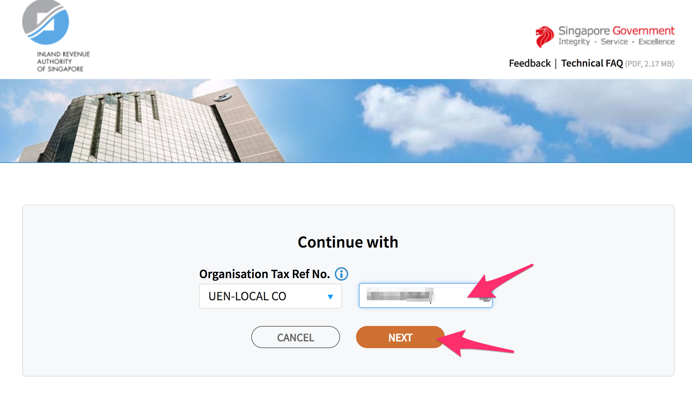

4. Click `File Form CS`
  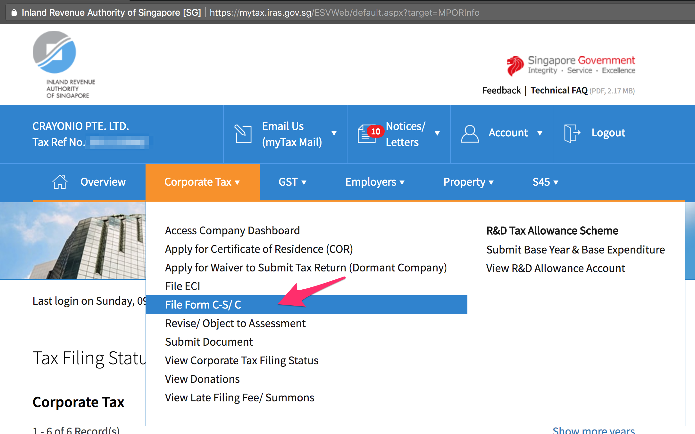

5. Part A - All conditions met
  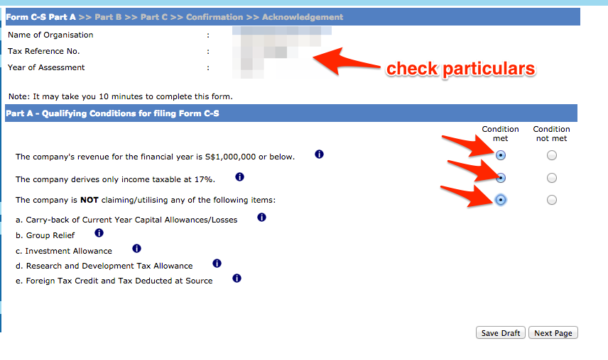

6. Part B - Tax Adjustments
  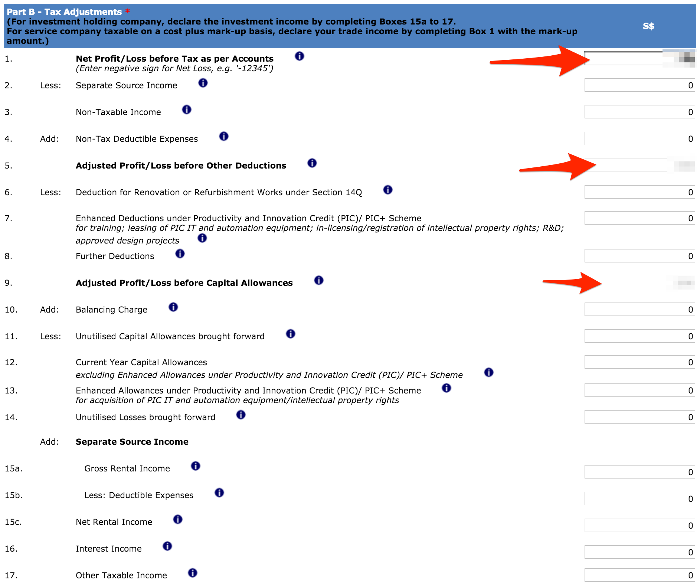

7. Fill up the numbers
  - Net Profit/Loss before Tax as per Accounts (Total income less total expenses per the Profit & Loss Statement.)
  - Gross Profit/Loss
    (Enter negative sign for Gross Loss, e.g. '-123456')
  - Expenses
    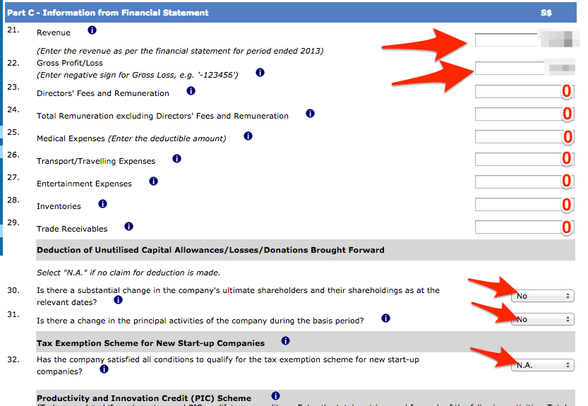

8. Declaration of filing
  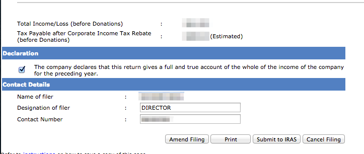

---

## ACRA

> 15 Nov: File AGM / Annual Filling with ACRA

1. Go to [Bizfile](http://www.bizfile.gov.sg/)
1. Click `Explore eServices` > `Local Company`
	
1. Click `Filing of Annual Return by Local Company`
	
1. Fill in UEN number
  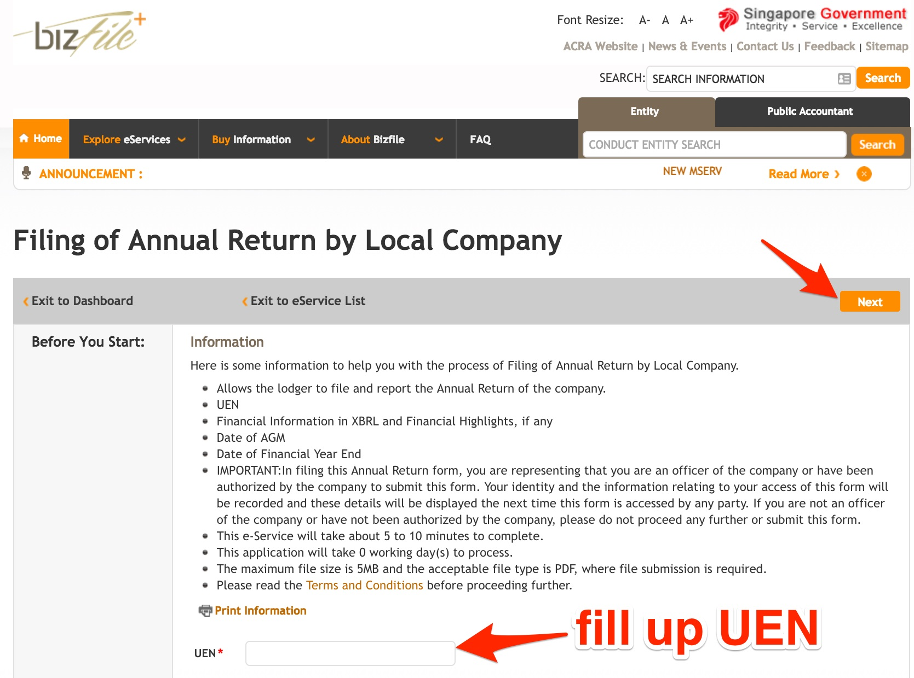
3. Fill up **Company Details** and click `Submit`
  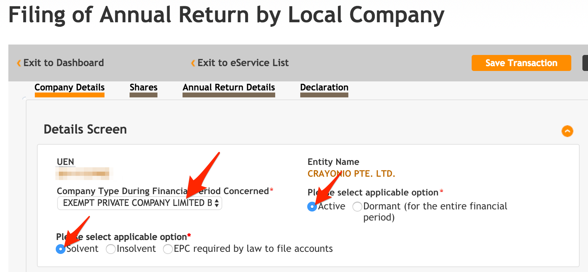

4. Fill up **Annual Return Details** and click `Submit`
  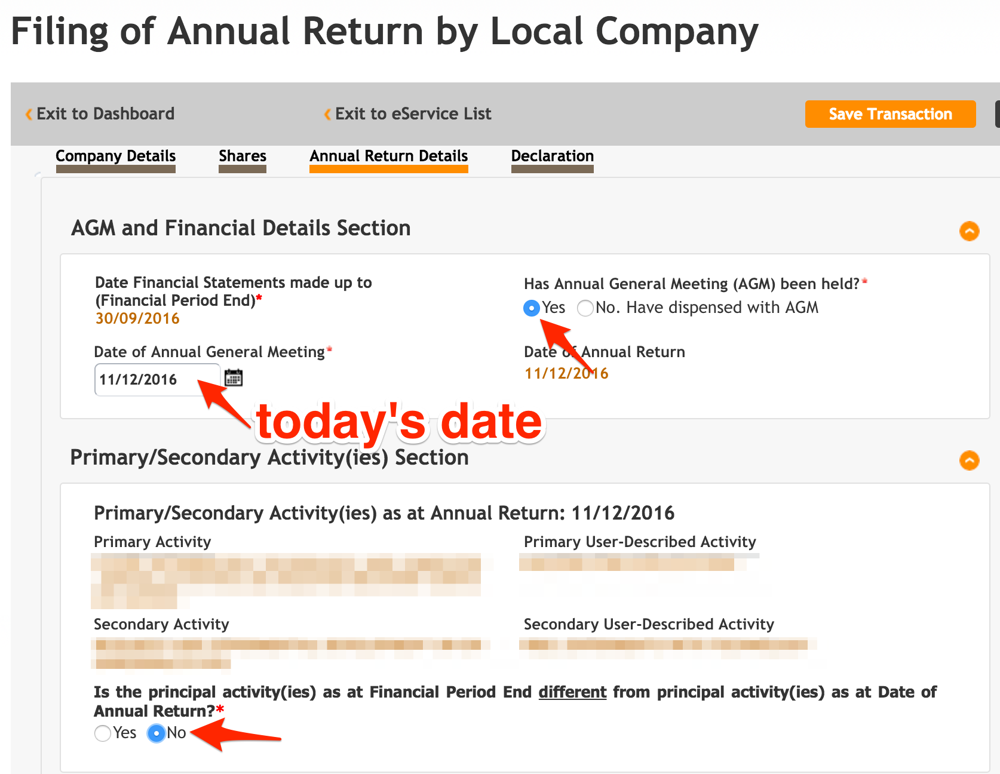
  

5. Fill up **Declaration** and click `Submit`
  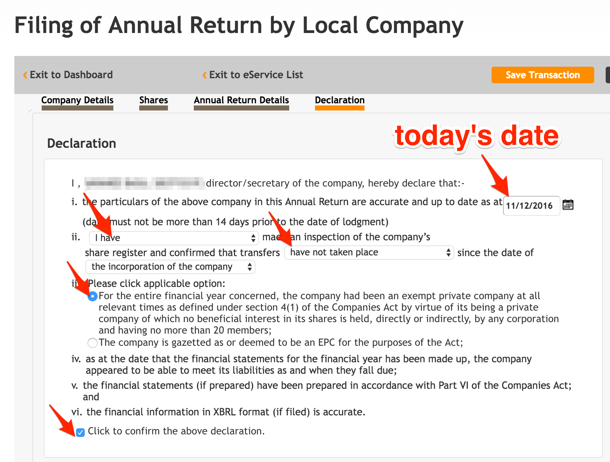
  

6. Preview and pay `SGD 60`
7. Print the Acknowledgement
  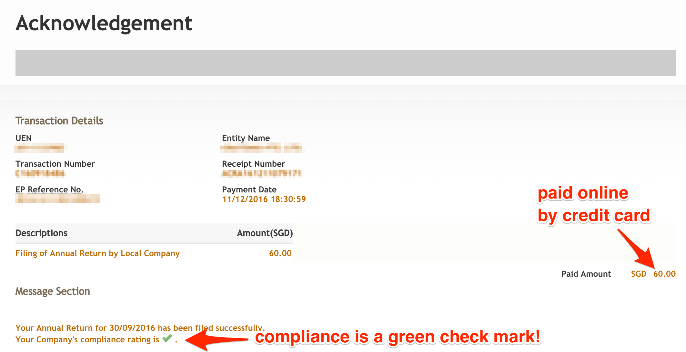
